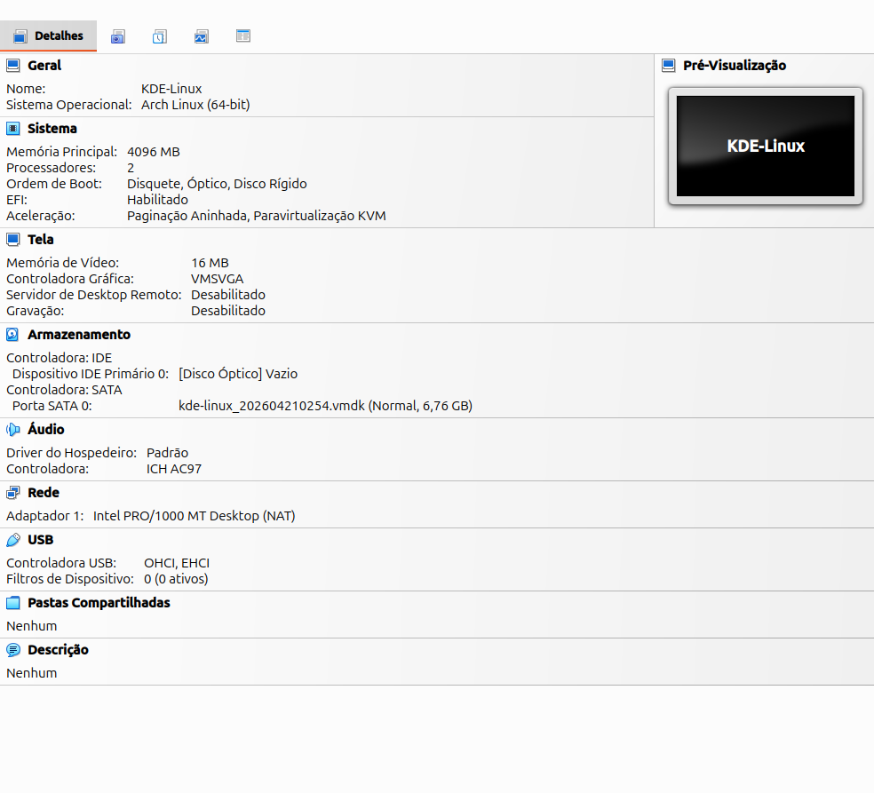
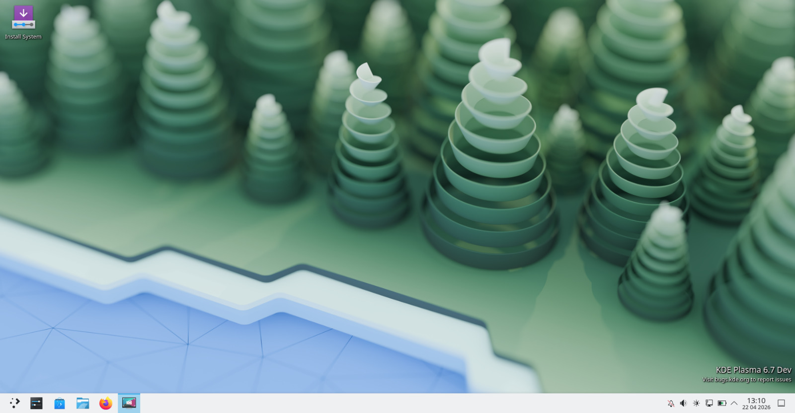

# Diário de Bordo – Arthur Gomes

## Sprint 0 - 13/04/2026 - 19/04/2026

---

## Resumo da Sprint

Nesta sprint, o foco principal foi preparar o ambiente para rodar o **KDE Linux** em uma máquina virtual no Windows.

Durante o processo, enfrentei dificuldades relacionadas à configuração do ambiente, especialmente na conversão do arquivo `.raw` para um formato compatível com o VirtualBox e na inicialização da máquina virtual.

Apesar dos erros de boot enfrentados, consegui avançar significativamente na compreensão do processo de virtualização e na configuração de ambientes Linux experimentais.

---

| Data  | Atividade | Tipo (Código/Doc/Discussão/Outro) | Link/Referência | Status |
|------|----------|----------------------------------|----------------|--------|
| --/-- | Instalação do VirtualBox | Setup | https://www.virtualbox.org/wiki/Downloads | Concluído |
| 21/04 | Download da imagem `.raw` do KDE Linux | Setup | https://kde.org/linux/docs/install-vm/ | Concluído |
| 21/04 | Conversão da imagem `.raw` para `.vmdk` com VBoxManage | Código | - | Concluído |
| 21/04 | Criação da máquina virtual no VirtualBox | Setup | - | Concluído |
| 21/04 | Configuração de EFI, disco e tentativa de boot | Setup | - | Concluído |


---

## Maiores Avanços

- Ambiente local preparado

---

## Maiores Dificuldades

- Falha de inicialização da imagem do KDE Linux

---

## Aprendizados

- Conversão entre formatos de disco (.raw, .vmdk)

---

## Subir o KDE Linux no VirtualBox

---

### 1.Instalação do VirtualBox


https://www.virtualbox.org/wiki/Downloads


---

### 2. Download da imagem do KDE

https://kde.org/linux/docs/install-vm/

---

### 3. Conversão da imagem `.raw` para VMDK

```bash
VBoxManage convertfromraw kde-linux_*.raw kdelinux2.vmdk --format VMDK
```
## 4. Criação da Máquina Virtual

- Nome: KDE Linux  / Arch Linux  

---

## 5. Configuração de Hardware

- Memoria Principal: 8192 MB  
- Processadores: 2

---

## 6. Configuração de Firmware

Ativar EFI:

Configurações → Sistema → Placa-mãe → Recursos  →  UEFI 

---


## 7. VM em execução






---

## Plano Pessoal para a Próxima Sprint

- [ ] Procura de Issues  