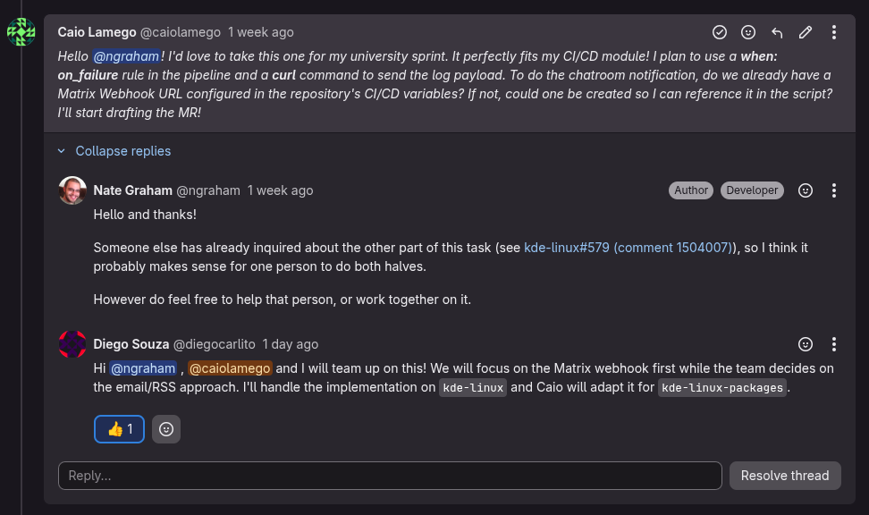
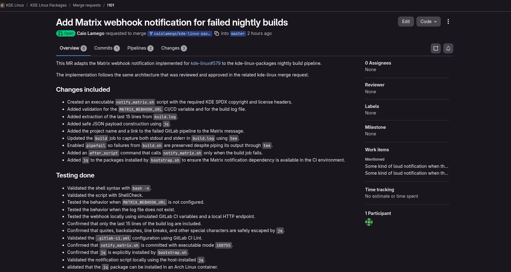

### Diário de Bordo – Caio Lamego

#### Sprint 0
##### Resumo da Sprint
Nesta sprint inicial, o foco principal foi estabelecer a comunicação com a comunidade KDE, compreender as políticas do projeto e superar a complexidade de configurar o ambiente local. Diferente de softwares tradicionais, o projeto escolhido (KDE Linux) é um sistema operacional imutável em desenvolvimento ativo ("cutting-edge immutable OS"). O esforço técnico principal concentrou-se na criação de uma Máquina Virtual no Linux hospedeiro e no mapeamento de melhorias (Issues) para as próximas etapas.

###### Atividades Realizadas
| Data | Atividade | Tipo | Status |
|---|---|---|---|
| 16/04/2026 | Abertura do repositório de documentação| Configuração | Concluído |
| 17/04/2026 | Leitura do Código de Conduta e políticas da comunidade | Estudo | Concluído |
| 17/04/2026 | Apresentação na comunidade (#new-contributors) no Matrix | Discussão | Concluído |
| 17/04/2026 | Busca no repositório (GitLab CI/CD) para baixar a imagem do SO | Estudo | Concluído |
| 18/04/2026 | Configuração de firmware e ambiente via `virt-manager` | Configuração | Concluído |
| 19/04/2026 | Mapeamento de tarefas (Filtro por Issues `Newcomer`) | Estudo | Concluído |

##### Maiores Avanços
* **Integração com a Comunidade:** Entendi que a comunidade KDE utiliza o Matrix para comunicação em tempo real e o ambiente Invent (GitLab) para o rastreamento do código e tarefas. Me apresentei formalmente na sala `#new-contributors:kde.org`.

* **Ambiente de Desenvolvimento de Pé:** Consegui configurar a máquina virtual no `virt-manager` utilizando os parâmetros exigidos (4 CPUs e 4096 MB de RAM). Importei o artefato de compilação da imagem e consegui instalar o KDE Linux no disco secundário formatado (`vdb - 20 GiB`). O sistema está rodando localmente de forma isolada!

##### Maiores Dificuldades
* **Mudança de Paradigma no Ambiente de Testes e Build:** Tive uma grande dificuldade inicial para compreender a arquitetura do ambiente local e como os meus testes de código seriam realizados na prática. Em projetos convencionais (como aplicações web abordadas em outros semestres), o padrão é clonar o código, instalar dependências e "subir" o ambiente compilando tudo no próprio terminal do hospedeiro (usando ferramentas como Docker, Node, etc.). No KDE Linux, por se tratar de um Sistema Operacional Imutável inteiro, o fluxo é radicalmente diferente. Demorei a entender que eu **não devo compilar o código localmente**. O ambiente de desenvolvimento em si é a Máquina Virtual rodando o arquivo `.raw`; as alterações que eu fizer no código do meu *fork* serão enviadas e construídas (*build*) pelos servidores do GitLab através de pipelines de CI/CD. A VM atua apenas como o laboratório final de testes, o que exigiu uma forte quebra de expectativa sobre o que significa "configurar o ambiente local" em projetos de sistemas operacionais.

##### Lições Aprendidas
* **Cultura de Contribuição:** Entendi a fundo os pilares do Código de Conduta do KDE, especialmente os de pragmatismo e colaboração mútua ("Be collaborative", "Be pragmatic"). Seguir as diretrizes oficiais e se comunicar ativamente é a chave.
* **Atenção Estrita à Documentação:** Seguir passo a passo a documentação oficial (quando existente) é crucial para evitar erros críticos de setup. Existem erros já previstos na documentação, e isso é importante para saber que tipo de problemas podem surgir e como resolvê-los, e entender que o build do ambiente não saiu do controle.
* **Curadoria de Tarefas:** Aprendi que ter a tag de bug não significa que a tarefa está pronta para desenvolvimento. É crucial evitar Issues marcadas como `Upstream issue` (ex: Issue #448 ou a #589 sobre Kernel Panic) pois estas dependem de alterações em repositórios de terceiros. Além disso conheci as tags `Newcomer` e `Good First Issue`, que são indicativos de tarefas mais acessíveis para novos contribuidores.

##### Mapeamento das Políticas de Contribuição e Qualidade
Diferente de repositórios comerciais no GitHub, o ecossistema do KDE possui uma estrutura descentralizada de ferramentas e políticas, gerida através de sua própria infraestrutura:

* **Gestão de Código e Revisão (KDE Invent):** O projeto não utiliza GitHub nem a nomenclatura de *Pull Requests (PRs)*. Todo o controle de versão, submissão de código e revisão *peer-to-peer* (desenvolvedor para desenvolvedor) ocorre no **KDE Invent**, uma instância do GitLab. As submissões de código são feitas através de **Merge Requests (MRs)**.
* **Separação de Issues e Bugs:** O rastreamento de problemas é categorizado. Tarefas de desenvolvimento, planejamento e *good-first-issues* (Newcomers) ficam no painel de *Work items* do GitLab. No entanto, relatos de falhas pelos usuários são gerenciados separadamente através do **KDE Bugzilla** (KDE Bugtracker).
* **Política de Nomenclatura e Pragmatismo:** Em vez de ditar regras estritas e burocráticas sobre prefixos de *branches* (como `feat/`, `bugfix/`), a política do KDE baseia-se no seu **Código de Conduta**, exigindo um desenvolvimento *pragmático* e *colaborativo*. A regra de ouro descrita na wiki oficial é a **transparência**: o contribuidor deve usar os canais de comunicação (Matrix ou comentários nas Issues do Invent) para discutir a implementação e avisar a comunidade antes de submeter um MR pesado.

##### Mapeamento de Issues
* Acessamos o painel de *Work Items* no Invent (GitLab) e utilizamos os filtros `Label is Newcomer` e `State is Open` para encontrar tarefas voltadas para novos desenvolvedores. 
* Mapeamento das seguintes Issues com alto potencial para a nossa primeira contribuição:
  * **Issue #164:** Melhorar a descrição de atualização no aplicativo *Discover* (Atualmente exibe um texto muito genérico do KDE Linux).
  * **Issue #319:** Adicionar um *slideshow* de imagens no momento da instalação do sistema usando o Calamares.
  * **Issue #531:** Adicionar instruções na documentação sobre como usar o `mkosi` para criar imagens customizadas.

##### Plano Pessoal para a Próxima Sprint
* [ ] Escolher ativamente uma das Issues mapeadas acima e solicitar a atribuição (*assign*) no GitLab.
* [ ] Mapear a arquitetura e estudar o *codebase* específico da Issue escolhida no repositório.
* [x] Realizar alterações no meu repositório (*fork*) e rodar testes na Máquina Virtual.
* [x] Abrir o primeiro Pull Request / Merge Request.

#### Sprint 1 - 27/04/2026 - 04/05/2026

##### Resumo da Sprint
Nesta sprint, o foco absoluto foi realizar a primeira contribuição real para o repositório do projeto. No entanto, houve altíssima concorrência: as poucas issues ativas com a tag `Newcomer` já tinham sido escolhidas por outros membros da comunidade ou por colegas da nossa equipe (como a Issue #164, a #319, a #219 e a #531). Para não travar meu desenvolvimento, comparei a documentação oficial da Wiki e o `README.md` principal do repositório. Criei uma nova Issue apontando uma falta de informação sobre o onboarding e resolvi através de um *Merge Request*, respeitando as políticas da comunidade.

| Data | Atividade | Tipo (Código/Doc/Discussão) | Status |
|---|---|---|---|
| 03/05/2026 | Comunicação prévia com a comunidade no Matrix | Discussão | Concluído |
| 03/05/2026 | Criação de nova Issue no Invent sobre onboarding de VMs | Doc/Gestão | Concluído |
| 03/05/2026 | Inserção da seção "Test it in a Virtual Machine" no `README.md` | Código/Doc | Concluído |
| 03/05/2026 | Abertura do meu Primeiro Merge Request (MR) | Código | Concluído |
| 04/05/2026 | MR aceito e merge concluído | Código | Concluído |

##### Maiores Avanços
* **Etiqueta Open Source e Comunicação:** Antes de simplesmente abrir a Issue, apliquei os princípios de "Be collaborative" e "Be pragmatic" do Código de Conduta do KDE. Fui até o canal oficial no Matrix e avisei os mantenedores previamente sobre a minha intenção de alterar o `README.md`, respeitando o aviso do repositório que pede aos usuários para consultarem a comunidade antes de reportarem *issues*.

* **Senso Crítico e Auditoria (A identificação do gargalo):** Ao realizar uma revisão na Wiki oficial do KDE, notei que pudesse ser necessária uma Issue: *Quando um desenvolvedor entra no repositório de código do KDE Linux, a primeira coisa que ele vê é o arquivo `README.md`. Atualmente, ele não possui nenhum alerta sobre o UEFI e não guia o desenvolvedor de forma clara para ler a página da Wiki. O desenvolvedor acaba tentando montar a Máquina Virtual de forma intuitiva, usa o BIOS antigo por padrão, e o sistema quebra.*

* **Primeira Contribuição:** Contribuição para a comunidade solucionando essa falha apontada acima. Inseri a seção `Test it in a Virtual Machine` no `README.md` alertando sobre o UEFI e submeti meu primeiro *Merge Request*.

* **MR aprovado:** O Merge Request foi aprovado pelos mantenedores do KDE e integrado ao código principal, dessa forma atualizando a documentação do projeto.

##### Maiores Dificuldades
* **Concorrência Agressiva por Issues:** A maior dificuldade da sprint foi a alta de tarefas, por serem poucas de newcomers e por estarem sendo disputadas por diversos membros da comunidade. A maioria das Issues mais acessíveis já estavam atribuídas, o que me forçou a criar minha própria Issue.

##### Aprendizados
* **A Importância da Transparência:** Aprendi que, no Open Source, o processo de comunicação (avisar no Matrix, justificar a Issue) é tão importante quanto o código em si. Respeitar as regras de governança do repositório abre portas mais facilmente.
* **A Importância do README:** Compreendi que ter uma boa documentação na Wiki não basta se o arquivo raiz do repositório não conduzir ativamente os novos contribuidores até ela e não fizer alertas de infraestrutura para os ambientes locais de *build* e teste.

##### Plano Pessoal para a Próxima Sprint
* [x] Acompanhar a revisão (*Code Review*) do meu Merge Request pelos mantenedores do KDE.
* [ ] Começar a contribuir em novas Issues, além de Newcomer, para ganhar mais experiência com o código.
* [ ] Estudar o *codebase* com maior antecedência para a Sprint 2, buscando atuar ativamente em *issues* de código.

#### Sprint 2

##### Resumo da Sprint
Nesta sprint, o objetivo foi aprofundar a contribuição no ecossistema do KDE Linux, focando em tarefas de configuração, integração e infraestrutura. O processo foi marcado por intensa comunicação com os mantenedores oficiais, exigindo adaptações rápidas (pivôs) no plano de ação original devido à altíssima concorrência. Tentei assumir múltiplas tarefas (Issues #586, #578 e #21), vivenciando na prática os desafios de governança, concorrência interna da equipe, dependências de roadmap e alocação de tarefas distribuídas em um projeto Open Source em fase Beta.

##### Planejamento Inicial e Escolha da Issue #586
A primeira tarefa selecionada para a Sprint 2 foi a **Issue #586: "Add a /etc/motd on the base OS explaining that most stuff is in Kapsule"**. A tarefa consistia em adicionar um banner de terminal (Message of the Day) na imagem base do sistema operacional, instruindo novos usuários sobre a natureza imutável do SO e direcionando-os ao uso do contêiner Kapsule. 

Essa issue foi escolhida por ter um alto impacto na Experiência do Desenvolvedor (DevEx) e estar alinhada com o escopo de configuração de pacotes e infraestrutura.

###### Comunicação e Etiqueta Open Source (Matrix e GitLab)
Seguindo o Código de Conduta do KDE, antes de submeter qualquer código, iniciei o processo de comunicação.
Fui ao canal oficial do projeto no Matrix (`#kde-linux:kde.org`) para avisar a comunidade sobre a minha intenção de assumir a tarefa e pedi direcionamento técnico sobre onde os arquivos do `/etc/` eram populados durante o *build* (mkosi).

Em seguida, registrei formalmente o meu interesse comentando na própria Issue no GitLab.

---

###### Colaboração, Mentoria e Gerenciamento de Dependências
A resposta da comunidade foi extremamente rápida, resultando em duas interações cruciais com os mantenedores principais do KDE Linux:

**A. Mentoria Técnica:**
O desenvolvedor Hadi Chokr respondeu ao meu comentário quase imediatamente, indicando o caminho exato para a injeção de arquivos: *"They are defined in the mkosi.extra folder"*. Isso demonstrou a alta colaboração da comunidade.

**B. Bloqueio por Dependência de Roadmap:**
Logo após eu iniciar a estruturação do código, o mantenedor líder (Nate Graham) interveio avisando que a Issue #586 era prematura. Ele explicou que a tarefa dependia da conclusão prévia da **Issue #584 (Full Kapsule integration)** [1] e que fazer o *Merge Request* agora direcionaria os usuários para um "canteiro de obras".

**Ação Tomada:** Entendendo os princípios de evolução de software e dependências de *features*, concordei com o mantenedor, cancelei a alteração no código para evitar conflitos na base principal e me retirei da tarefa.

##### Tentativas de novas issues e alta concorrência (Issues #578 e #21)
Com a paralisação da #586, iniciei uma busca por novas opções de contribuição, focando em CI/CD:
1. **Issue #578 ("On-demand CI job to delete the latest build"):** Escolhi esta tarefa por envolver a manipulação de jobs sob demanda no pipeline. Contudo, rapidamente descobri que ela já havia sido assumida por outro mantenedor, o que inviabilizou minha atuação.
2. **Issue #21 ("Loud notification on nightly build failure" - kde-linux-packages):** Encontrei esta issue com a tag `Newcomer`. Ao demonstrar interesse, o mantenedor Nate Graham me respondeu explicando que essa tarefa era a "outra metade" da Issue #579 (do repositório principal). Mais uma vez não foi possível realizar uma issue que teoricamente estava livre para desenvolver, mesmo com a tag de Newcomer.

---
##### Maiores Avanços
* **Gerenciamento de Dependências e Governança:** Consegui vivenciar o fluxo real de uma feature sendo bloqueada pelo roadmap do projeto. A Issue #586 exigia adicionar um aviso no `/etc/motd` sobre o Kapsule, mas o mantenedor Nate Graham interveio para informar que a integração do Kapsule (Issue #584) não estava pronta. 
* **Mentoria e Código de Conduta:** A comunicação no Matrix antes de codificar funcionou perfeitamente. O desenvolvedor Hadi Chokr me respondeu quase imediatamente no GitLab, orientando que a injeção de arquivos ocorria na pasta `mkosi.extra`, poupando horas de busca na arquitetura do sistema.

##### Maiores Dificuldades
* **Bloqueio de Tarefa no Meio da Execução:** A paralisação da Issue #586 logo após o início do trabalho me forçou a reorganizar a sprint de última hora e a justificar de forma profissional minha saída da tarefa.
* **Concorrência por Issues Newcomer:** A tentativa de pivotar para a Issue #579 (notificação de erro no pipeline) falhou pois a alta concorrência na comunidade e a escassez de issues com a label `Newcomer` fizeram com que ela já estivesse tomada.
* **Compreensão de Pipelines de CI:** Aprender a estrutura do `.gitlab-ci.yml` do projeto para injetar de forma segura um job `when: manual` sem quebrar o restante da integração contínua do repositório principal exigiu grande esforço investigativo.

##### Aprendizados
* **O Valor da Comunicação Prévia:** Salvei horas de trabalho. Se eu tivesse feito o Merge Request da #586 em silêncio, ele seria rejeitado por expor uma funcionalidade incompleta.
* **Ecossistema Mkosi:** Mesmo não finalizando a #586, ganhei um conhecimento técnico sobre a montagem de imagens de sistemas imutáveis usando `mkosi`, e como as customizações são injetadas no nível raiz através de arquivos de configuração, ao invés da compilação tradicional.

#### Sprint 3

##### Resumo da Sprint

Nesta sprint, retomei a **Issue #21 do repositório `kde-linux-packages`**, relacionada à criação de uma notificação para falhas nas compilações noturnas do KDE Linux. A tarefa foi desenvolvida em conjunto com Diego Souza: ele ficou responsável pela **Issue #579 no repositório principal `kde-linux`**, enquanto eu adaptei a mesma solução para o pipeline de construção dos pacotes.

Essa divisão foi definida após uma conversa com o mantenedor Nate Graham. Como as duas issues representavam partes do mesmo problema, trabalhamos de forma coordenada para manter a mesma arquitetura e o mesmo padrão de implementação nos dois repositórios.

Ao final da sprint, implementei a solução, realizei os testes necessários e abri o **Merge Request !101** no repositório `kde-linux-packages`.

**Links:**

* [Issue #21 — kde-linux-packages](https://invent.kde.org/kde-linux/kde-linux-packages/-/work_items/21)
* [Issue #579 — kde-linux]([https://invent.kde.org/kde-linux/kde-linux/-/work_items/579)
* [Merge Request !101](https://invent.kde.org/kde-linux/kde-linux-packages/-/merge_requests/101)

##### Atividades Realizadas

| Atividade                                           | Tipo                   | Status    |
| --------------------------------------------------- | ---------------------- | --------- |
| Alinhamento da implementação com Diego Souza        | Discussão/Planejamento | Concluído |
| Análise do `.gitlab-ci.yml` do `kde-linux-packages` | Estudo/Código          | Concluído |
| Criação do script `notify_matrix.sh`                | Código                 | Concluído |
| Configuração da captura do log de compilação        | CI/CD                  | Concluído |
| Inclusão do `jq` como dependência do ambiente       | Configuração           | Concluído |
| Testes locais do script e do payload JSON           | Testes                 | Concluído |
| Abertura do Merge Request !101                      | Código                 | Concluído |

##### Colaboração nas Issues #579 e #21

Na sprint anterior, o mantenedor Nate Graham havia informado que a Issue #21 era a outra metade da Issue #579. Posteriormente, Diego e eu comunicamos à comunidade que trabalharíamos juntos: ele implementaria a solução no repositório principal e eu faria a adaptação no repositório de pacotes.

A implementação do Diego passou por revisão dos mantenedores, que solicitaram ajustes como a inclusão dos cabeçalhos SPDX. A partir dessa revisão, utilizei a mesma arquitetura no meu código, evitando criar duas soluções diferentes para o mesmo problema.

<!-- INSERIR PRINT DA CONVERSA NA ISSUE MOSTRANDO A PARCERIA COM DIEGO -->

##### Implementação da Notificação no Matrix

Foi criado o script executável `notify_matrix.sh`, responsável por enviar uma mensagem para uma sala do Matrix quando o job de compilação falhar.

O script:

* verifica se a variável de CI/CD `MATRIX_WEBHOOK_URL` está configurada;
* recebe o arquivo `build.log`;
* extrai as últimas 15 linhas do log com o comando `tail`;
* cria um payload JSON seguro utilizando `jq`;
* inclui na mensagem o nome do projeto e o link da pipeline;
* envia a notificação para o Matrix utilizando `curl`.

O arquivo foi versionado com permissão de execução `100755`.

##### Alterações no Pipeline do GitLab

Durante a análise do `.gitlab-ci.yml`, identifiquei que as compilações noturnas utilizavam o mesmo job `build`. Esse job foi ajustado para salvar as saídas e os erros no arquivo `build.log` sem esconder possíveis falhas do `build.sh`. Também foi adicionado um `after_script` que executa o `notify_matrix.sh` somente quando o job falha, enviando a notificação com as informações do erro.

##### Gerenciamento da Dependência `jq`

O script utiliza `jq` para gerar com segurança o JSON da notificação. Como não foi possível confirmar sua presença na imagem de CI da KDE por meio do Docker, o pacote foi adicionado ao `bootstrap.sh`, garantindo que a dependência seja instalada durante a preparação do ambiente.

##### Testes Realizados

Antes de abrir o Merge Request, realizei testes para verificar:

* a sintaxe do script com `bash -n`;
* a análise estática com `shellcheck`;
* o comportamento quando `MATRIX_WEBHOOK_URL` não está configurada;
* o comportamento quando o arquivo de log não existe;
* a seleção correta das últimas 15 linhas;
* a criação de um JSON válido com caracteres especiais;
* a permissão executável do arquivo;
* a ausência de erros de formatação no diff do Git.

Também foi utilizado um servidor HTTP local para simular o webhook e inspecionar o payload enviado pelo script, sem expor ou utilizar uma URL real do Matrix.

##### Abertura do Merge Request !101

Após concluir a implementação e os testes, enviei a branch para o meu fork e abri o **Merge Request !101** para a branch `master` do repositório oficial.

O MR apresenta as alterações realizadas no `notify_matrix.sh`, no `.gitlab-ci.yml` e no `bootstrap.sh`, além de explicar aos mantenedores que a variável `MATRIX_WEBHOOK_URL` precisa ser configurada no projeto oficial.

**Link:** [Merge Request !101](https://invent.kde.org/kde-linux/kde-linux-packages/-/merge_requests/101)

ALém disso, o pipeline continuou passando corretamente, conforme previsto:

##### Maiores Avanços

* **Primeira contribuição focada em CI/CD:** Diferentemente da contribuição anterior, que estava relacionada à documentação, esta sprint envolveu a modificação direta do pipeline de integração contínua do projeto.
* **Colaboração entre repositórios:** A solução foi desenvolvida em conjunto com Diego, mantendo a padronização entre o `kde-linux` e o `kde-linux-packages`.
* **Tratamento seguro de logs e segredos:** A URL do webhook não foi inserida no código. Ela será fornecida por uma variável protegida do GitLab CI/CD.
* **Integração com a comunidade:** A implementação seguiu a arquitetura que já havia sido revisada pelos mantenedores na Issue #579.

##### Maiores Dificuldades

* **Compreensão do comportamento de pipes no shell:** Foi necessário compreender que o uso de `tee` poderia esconder a falha do comando de build sem a configuração `pipefail`.
* **Validação do ambiente da CI:** A imagem utilizada pela infraestrutura da KDE não pôde ser executada diretamente pelo Docker local, exigindo uma solução alternativa para garantir a instalação do `jq`.
* **Adaptação entre repositórios:** Apesar de as duas issues tratarem do mesmo problema, os arquivos e jobs dos pipelines eram diferentes, sendo necessário identificar corretamente onde aplicar a solução no `kde-linux-packages`.

##### Aprendizados

* Alterações em CI/CD precisam ser testadas e revisadas com o mesmo cuidado de funcionalidades tradicionais.
* Aprendi como pipelines de comandos podem mascarar códigos de erro e como preservar corretamente uma falha ao utilizar `tee`.
* Reutilizar uma arquitetura já revisada reduz divergências, facilita o trabalho dos mantenedores e torna a solução mais consistente entre repositórios.

##### Plano Pessoal para a Próxima Sprint

* [ ] Acompanhar a pipeline e o processo de revisão do Merge Request !101.
* [ ] Responder aos comentários dos mantenedores e aplicar eventuais ajustes solicitados.
* [ ] Marcar as discussões como resolvidas após implementar as correções.
* [ ] Acompanhar a configuração da variável `MATRIX_WEBHOOK_URL` no projeto oficial.
* [ ] Registrar o resultado final do Merge Request, incluindo sua aprovação ou integração ao repositório.
