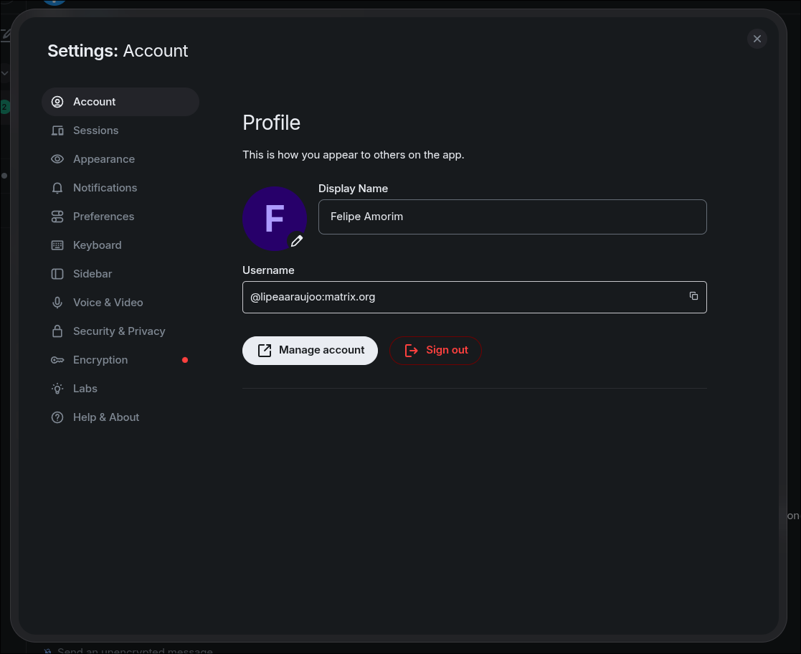
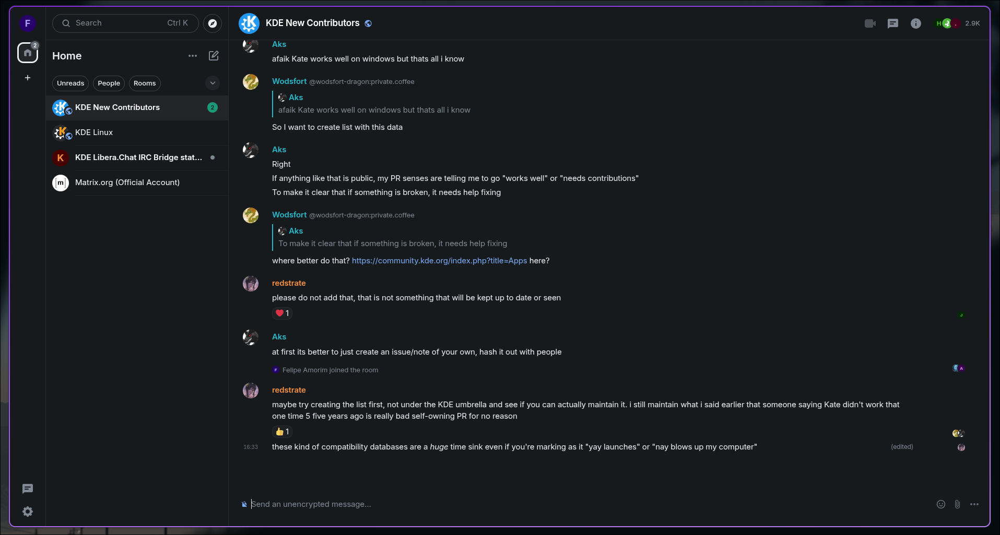
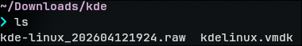
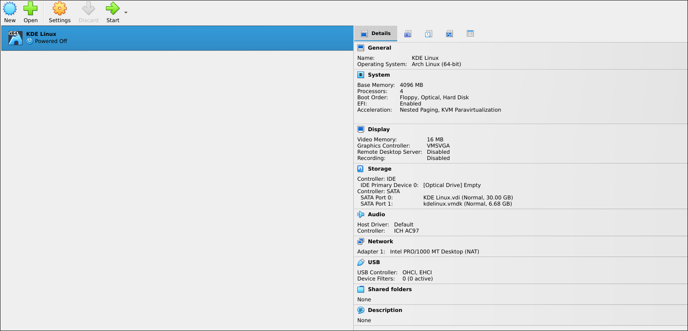
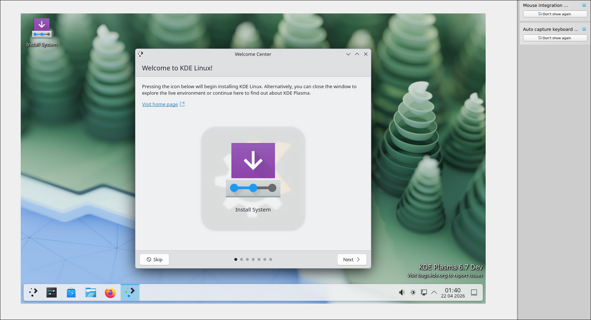
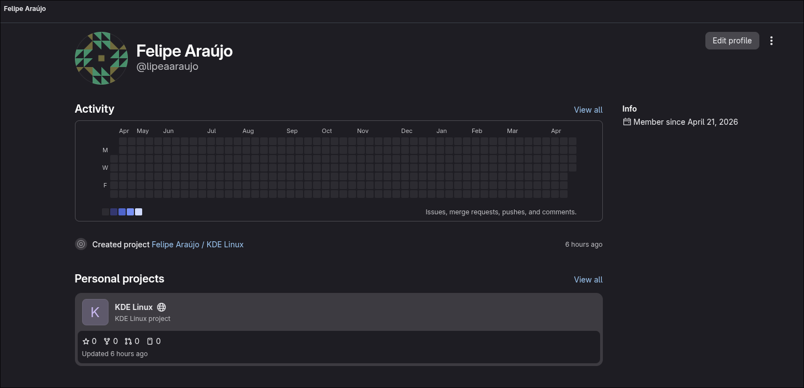
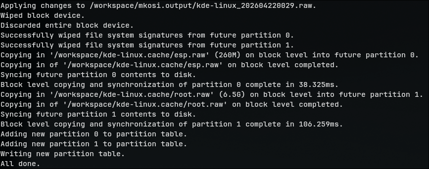
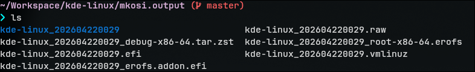
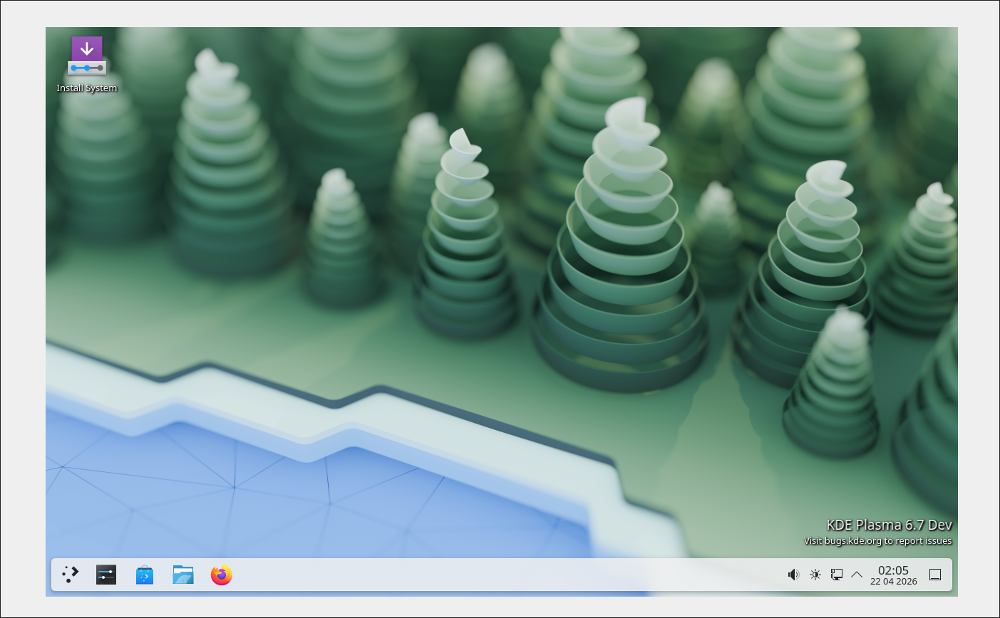

# Diário de Bordo – Felipe Amorim de Araújo

**Disciplina:** [Gerência de Configuração Evolução de Software]
**Equipe**: [KDE Linux]
**Comunidade/Projeto de Software Livre:** [KDE Linux]

---

## Sprint 0 – 08/04 - 22/04

### Resumo da Sprint

Nesse Sprint, foquei em me familiarizar com a comunidade KDE, seus canais de comunicação e o processo de contribuição. Realizei a instalação do KDE Linux em uma máquina virtual para entender melhor o ambiente de desenvolvimento e os requisitos para contribuir com o projeto. Também criei minha conta no Invent KDE e configurei meu ambiente local para realizar o build da imagem do KDE Linux utilizando o Podman. 

### Atividades Realizadas

| Data  | Atividade                                   | Tipo (Código/Doc/Discussão/Outro) | Link/Referência | Status    |
| ----- | ------------------------------------------- | --------------------------------- | --------------- | --------- |
| 11/04 | Primeira leitura dos guias de envolvimento e contribuição na comunidade KDE | Estudo | [Get Involved](https://community.kde.org/Get_Involved), [Wiki KDE Linux](https://community.kde.org/KDE_Linux), [Documentação KDE Linux](https://kde.org/linux/docs/) | Concluído |
| 11/04 | Criação da conta no Matrix e entrada nas salas do KDE New Contributors e KDE Linux | Discussão | [Perfil Matrix](./assets/matrix_account.png), [Salas do KDE](./assets/kde_rooms.png) | Concluído |
| 12/04 | Instalação do KDE Linux em uma máquina virtual | Código | [KDE Linux na VM](./assets/kde_linux_vm.png), [Tutorial](https://kde.org/linux/docs/install/), [Wiki](https://community.kde.org/KDE_Linux) | Concluído |
| 20/04  | Criação da minha conta no Invent KDE | Discussão | [Perfil](https://invent.kde.org/lipeaaraujo) | Concluído |
| 21/04 | Criação do fork do repositório principal do KDE Linux | Código | [Fork](https://invent.kde.org/lipeaaraujo/kde-linux) | Concluído |
| 21/04 | Configuração do ambiente de desenvolvimento e build da imagem do KDE Linux localmente | Código | [Mensagem de sucesso do build](./assets/build_message.png), [Arquivos gerados](./assets/generated_files.png), [Imagem buildada rodando na VM](./assets/kde_linux_vm_running.png)  | Concluído |

### Maiores Avanços

* **Familiarização com a comunidade KDE e seus canais de comunicação**: Consegui me familiarizar com os canais de comunicação da comunidade KDE, como o Matrix, e entender como participar das discussões e interações com outros membros da comunidade.
* **Criação da conta no Invent KDE**: Consegui criar minha conta no Invent KDE, o que é um passo fundamental para começar a contribuir com o código do projeto e participar ativamente da comunidade de desenvolvimento do KDE Linux.
* **Configuração do ambiente de desenvolvimento e build da imagem do KDE Linux localmente**: Consegui configurar o ambiente de desenvolvimento utilizando o Podman e realizar o processo de build da imagem do KDE Linux localmente, gerando os arquivos necessários para rodar o sistema operacional em uma máquina virtual.

### Maiores Dificuldades

* **Entrar nas rooms (Matrix)**: Tive problemas para entrar nas salas do Matrix, pois não tinha entendido que era possível entrar diretamente pelo homeserver do Matrix sem precisar logar no homeserver do KDE. 
* **Poucas issues abertas para novos contribuidores**: Notei que existem poucas issues abertas com a tag `Newcomer`, o que dificultou a identificação de tarefas mais simples para que eu pudesse começar a contribuir.

### Aprendizados

* **Interação em um ambiente de desenvolvimento de software livre**: Aprendi a dinâmica base de interação em uma comunidade de software livre, como participar das discussões, tirar dúvidas e colaborar com outros membros da comunidade.
* **Conhecer o ecossistema KDE**: Tomei conhecimento do ecossistema KDE, seus projetos e iniciativas, mesmo já até mesmo tendo utilizado ferramentas e softwares desenvolvidos pela comunidade KDE.
* **Conceitos do desenvolvimento de distribuições Linux**: Estudando o projeto e o repositório, pude entender melhor os conceitos envolvidos no desenvolvimento de uma distribuição Linux, construção de imagens, distribuição de pacotes e manutenção de um sistema operacional.

### Documentação das principais atividades

#### Criação da conta no Matrix e entrada nas salas do KDE

Essa seção está bem documentada na página [Matrix](https://community.kde.org/Matrix) na wiki da comunidade. Fiz o meu registro no homeserver do próprio Matrix (`matrix.org`) e entrei utilizando o cliente **Element**:



Após isso, por confusão minha, tentei entrar nas salas do KDE utilizando o homeserver do KDE (`kde.org`), mas não consegui logar. Depois de entender que era possível entrar diretamente pelo `matrix.org`, consegui acessar as salas do KDE New Contributors e KDE Linux:



---

#### Instalação do KDE Linux em uma máquina virtual

O processo de instalação do KDE Linux em uma VM já está bem documentado na [documentação principal do projeto](https://kde.org/linux/docs/install-vm/). Optei por criar uma VM com o VirtualBox por ser a opção mais simples de testar o sistema operacional e me familiarizar na minha máquina local.

Primeiramente fiz a instalação da imagem `.raw` do KDE Linux e conversão do arquivo para uma imagem VMDK:

```
VBoxManage convertfromraw kde-linux_*.raw kdelinux.vmdk --format VMDK
```



Após isso, abri o VirtualBox e criei uma nova máquina virtual seguindo as opções recomendadas na documentação e adicionando o arquivo `kdelinux.vmdk` como o disco rígido da máquina virtual:



Com a máquina virtual criada, consegui iniciar o KDE Linux e prosseguir com a instalação e configuração do SO, seguindo as instruções do próprio processo de instalação nativo do KDE Linux:



---

#### Criação da conta no Invent KDE e fork do repositório

As instruções para criação da conta no Invent KDE foram passadas para nós via Telegram pelo Farid. Resumia a acessar o [ambiente](https://invent.kde.org/), clicar em "Sign Up" e preencher os dados necessários para criar a conta.

Depois de criar a conta e configurar minhas chaves de acesso SSH, acessei o [repositório do KDE Linux](https://invent.kde.org/kde-linux/kde-linux), o qual o link também foi disponibilizado pelo Farid, e criei um fork do repositório para minha conta.



---

#### Processo de build da imagem do KDE Linux

Tendo criado o fork do repositório e clonado em minha máquina local, existem 2 opções para realizar o build da imagem do KDE Linux:

1. Build da imagem via Docker ou Podman, utilizando o script `./build_docker.sh [--podman] [--country <country-code>] [--parallel <num>]`.
2. Buildar em um host com Arch Linux, seguindo o pipeline de build:
    - `bootstrap.sh`: configura o ambiente de build, incluindo a instalação de dependências e configuração de repositórios personalizados do KDE.
    - `./build.sh [--force] [--debug]`: Orquestra o processo completo de build, desde a compilação de ferramentas Rust, geração do rootfs com mkosi, montagem da imagem de disco e criação dos arquivos de saída.

Optei por seguir com a primeira opção, utilizando o Podman ao invés do Docker. Um dos requisitos para fazer o build containerizado é ter o driver de storage Btrfs configurado no Docker/Podman, para que o processo de build possa montar os arquivos de sistema de arquivos necessários para a construção da imagem do KDE Linux. Utilizando o Podman consegui isolar a configuração para não impactar outros containers e projetos que estou rodando com o Docker.

O processo se resumiu em instalar o Podman e configurar o driver de storage Btrfs alterando no arquivo `/etc/containers/storage.conf`:

```
driver = "btrfs"
```


Também seguindo as instruções do guia de desenvolvimento, criei um arquivo de configuração local `mkosi.local.conf` para acelerar o processo de build, com o seguinte conteúdo:

```
[Content]
Environment=LOCALE_GEN="C.UTF-8 UTF-8"
Environment=MIRRORS_COUNTRY=br
Environment=PARALLEL_DOWNLOADS=50
```

Após isso, executei o comando de build utilizando o Podman:

```
./build_docker.sh --podman
```

Tive rodar o comando algumas vezes por conta de perdas de conexão com os repositórios necessários para a instalação e sincronização dos pacotes e dependências (em especial o `archive.archlinux.org`), mas consegui completar o processo de build e gerar a imagem do KDE Linux localmente:





Cada um dos arquivos gerados tem uma função específica no processo de boot e execução do KDE Linux, como descrito na tabela abaixo:

| Nome do arquivo | Descrição |
| ------------------------------------------- | -------------------------- |
| kde-linux_202604220029.raw                  | Imagem bootável    |
| kde-linux_202604220029.efi                  | Unified Kernel Image (UKI) |
| kde-linux_202604220029_erofs.addon.efi      | Erofs addon EFI            |
| kde-linux_202604220029_root-x86-64.erofs    | Rootfs comprimido          |
| kde-linux_202604220029_debug-x86-64.tar.zst | Arquivo de símbolos de debug      |
| kde-linux_202604220029/                     | Diretório do rootfs construído     |

Por fim, rodei a imagem buildada na máquina virtual utilizando o VirtualBox, e consegui iniciar o sistema operacional com sucesso, confirmando que o processo de build foi concluído corretamente:



### Plano Pessoal para a Próxima Sprint

* [ ] Explorar as issues abertas no repositório do KDE Linux e identificar uma issue com a tag `Newcomer` para começar a contribuir com código.
* [ ] Realizar a contribuição com a issue identificada, seguindo o processo de contribuição do projeto e interagindo com outros membros da comunidade para tirar dúvidas e receber feedback.
* [ ] Auxiliar outros membros da equipe com dúvidas e discussões relacionadas ao processo de build e desenvolvimento do KDE Linux, compartilhando o conhecimento adquirido durante essa Sprint.

---

