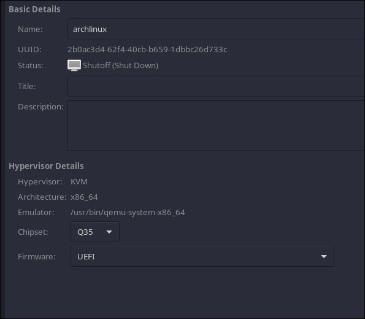
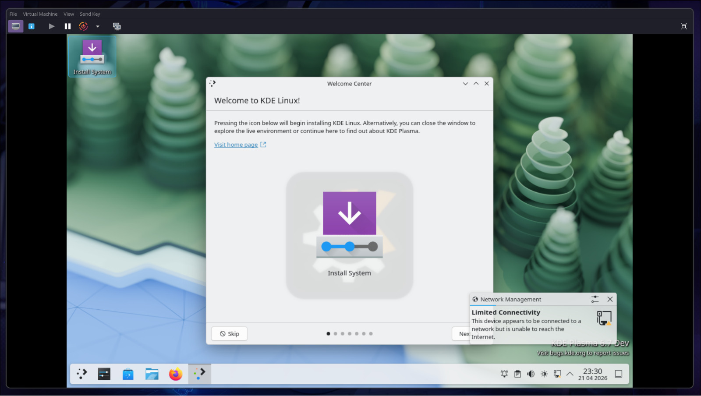

# Diário de Bordo – João Guilherme

## Sprint 0 - 13/04/2026 - 19/04/2026

### Resumo da Sprint

Nesta sprint, o foco principal foi preparar o ambiente para rodar o KDE Linux utilizando o QEMU através de uma interface gráfica (virt-manager). Como estou rodando o host no **Manjaro**, o processo foi focado em virtualização nativa no Linux, facilitando o setup e o registro.

| Data | Atividade | Tipo (Código/Doc/Discussão/Outro) | Link/Referência | Status |
| :--- | :--- | :--- | :--- | :--- |
| 20/04 | Instalação do QEMU e virt-manager | Setup | - | Concluído |
| 20/04 | Download da imagem do KDE Linux | Setup | [Link](https://kde.org/linux/docs/install-vm/) | Concluído |
| 20/04 | Criação da máquina virtual e configs (UEFI, hardware, disco) | Setup | - | Concluído |
| 21/04 | Criação do relatório de contribuição individual | Doc | - | Concluído |

### Maiores Avanços

* Configuração bem-sucedida do ambiente de desenvolvimento local usando QEMU via interface gráfica.

### Maiores Dificuldades

* Nenhuma dificuldade real. O único passo a mais foi precisar acessar a BIOS para habilitar a virtualização (VT-x) do meu processador i5-3570.

### Aprendizados

* Compreensão do uso de interfaces gráficas (virt-manager) para gerenciamento do QEMU.
* Entendimento da necessidade de firmware UEFI para boot de imagens Linux modernas.
* Montagem direta de imagens de disco bruto (`.raw`) como unidade de armazenamento principal da VM.

### Passo a Passo feito para Subir o KDE Linux no QEMU via GUI

#### 1. Instalação do QEMU e Interface Gráfica
Instalação dos pacotes necessários para virtualização no Manjaro:

```bash
sudo pacman -S qemu-desktop virt-manager libvirt edk2-ovmf dnsmasq iptables-nft
sudo systemctl enable --now libvirtd
```

#### 2. Download da imagem
Download do arquivo `.raw` direto da documentação oficial do KDE:
[https://kde.org/linux/docs/install-vm/](https://kde.org/linux/docs/install-vm/)

#### 3. Criação da Máquina Virtual e Configuração do Disco
Importação da imagem `.raw` nativa no virt-manager através da opção "Import existing disk image", montando-a diretamente como o disco principal da VM. Durante a criação, marquei a opção "Personalizar configuração antes de instalar" e defini o sistema operacional base como Arch Linux.

#### 4. Configuração de Hardware
Configurações de hardware para rodar o ambiente sem gargalos:
* **Memória:** 8192 MB
* **Processadores:** 4 cores

#### 5. Configuração de Firmware
Alteração do firmware da máquina de BIOS Legacy para **UEFI** (provido pelo pacote edk2-ovmf). Passo obrigatório para que a imagem do KDE Linux consiga encontrar a partição EFI no disco `.raw` e iniciar corretamente.

## 6. Evidências da Execução



*Configuração do Firmware UEFI nas propriedades da VM.*



*KDE Linux rodando com sucesso após o boot inicial.*
---

### Plano Pessoal para a Próxima Sprint

* [ ] Encontrar issue para contribuir no projeto
