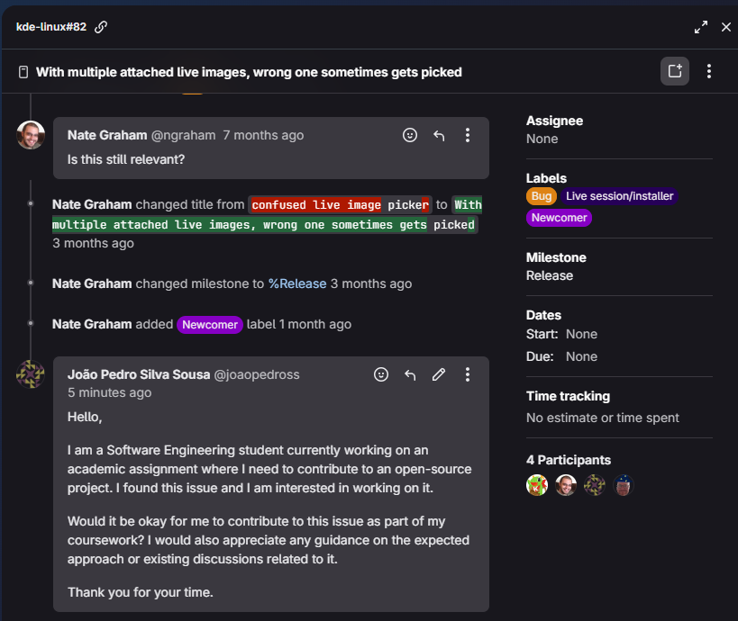

# Diário de Bordo – João Pedro

## Sprint 0 - 13/04/2026 - 19/04/2026

---

## Resumo da Sprint

Nesta sprint, o foco principal foi preparar o ambiente para rodar o **KDE Linux** em uma máquina virtual no Windows.

Durante o processo, enfrentei dificuldades relacionadas à configuração do ambiente, especialmente na conversão do arquivo `.raw` para um formato compatível com o VirtualBox e na inicialização da máquina virtual.

Apesar dos erros de boot enfrentados, consegui avançar significativamente na compreensão do processo de virtualização e na configuração de ambientes Linux experimentais.

---

| Data  | Atividade | Tipo (Código/Doc/Discussão/Outro) | Link/Referência | Status |
|------|----------|----------------------------------|----------------|--------|
| 17/04 | Instalação do VirtualBox | Setup | [Link](https://www.virtualbox.org/wiki/Downloads) | Concluído |
| 18/04 | Download da imagem `.raw` do KDE Linux | Setup |  [Link](https://kde.org/linux/docs/install-vm/) | Concluído |
| 18/04 | Conversão de `.raw` para `.vmdk` com VBoxManage | Código | - | Concluído |
| 19/04 | Criação da máquina virtual no VirtualBox | Setup | - | Concluído |
| 19/04 | Configuração de EFI, disco e tentativa de boot | Setup | - | Concluído |

---

## Maiores Avanços

- Consegui preparar meu ambiente local para desenvolver o projeto

---

## Maiores Dificuldades

- Falha de inicialização da imagem do KDE Linux

---

## Aprendizados

- Diferença entre formatos de disco (`.raw`, `.vmdk`, `.vdi`)  
- Importância do EFI/UEFI no boot de sistemas modernos  
- Uso de ferramentas de linha de comando do VirtualBox  
- Crição de máquinas virtuais funcionais

---

## Passo a Passo feito para Subir o KDE Linux no VirtualBox (Windows)

---

### 1. Download da imagem

Baixar o arquivo `.raw` do KDE Linux:

https://kde.org/linux/docs/install-vm/


---

### 2. Instalação do VirtualBox

https://www.virtualbox.org/wiki/Downloads

---

### 3. Conversão da imagem `.raw` para VMDK

```powershell
cd "C:\Program Files\Oracle\VirtualBox"

& 'C:\Program Files\Oracle\VirtualBox\VBoxManage.exe' convertfromraw (Get-ChildItem kde-linux_*.raw).FullName kdelinux2.vmdk --format VMDK

```
## 4. Criação da Máquina Virtual

- Nome: KDE Linux  
- Tipo: Arch Linux 
- Versão: Arch Linux (64-bit)  

---

## 5. Configuração de Hardware

- Memoria Principal: 8192 MB  
- Processadores: 2

---

## 6. Configuração de Firmware

Ativar EFI:

Configurações → Sistema → Placa-mãe → Enable EFI  

---

## 7. Configuração do Disco

- Ir em Armazenamento  
- Adicionar o arquivo `.vmdk`  
- Conectar à controladora SATA ou IDE  

---

## 8. VM em execução


---

## Plano Pessoal para a Próxima Sprint

- [ ] Encontrar issue para contribuir no projeto  

## Sprint 1 - 20/04/2026 - 04/05/2026

---

## Resumo da Sprint

Neste sprint, meu foco foi entender o projeto KDE Linux e conseguir iniciar minha primeira contribuição. No início, tive dificuldade em encontrar uma issue adequada para iniciantes, especialmente com a tag *Newcomer*. Após explorar o repositório e analisar diferentes tarefas disponíveis, consegui identificar uma issue compatível com meu nível.

Após encontrar a issue, entrei em contato com a comunidade do projeto solicitando autorização para trabalhar nela como parte de uma atividade acadêmica.

---

## Atividades

| Data  | Atividade | Tipo (Código/Doc/Discussão/Outro) | Link/Referência | Status |
| ----- | --------- | --------------------------------- | --------------- | ------ |
| 20/04 | Busca por issues com a tag Newcomer | Outro | - | Concluído |
| 22/04 | Análise de issues disponíveis no repositório | Outro | - | Concluído |
| 30/04 | Identificação de uma issue compatível | Outro | - | Concluído |
| 04/05 | Envio de mensagem solicitando contribuição na issue | Discussão | - | Concluído |

---

## Maiores Avanços

- Consegui encontrar uma issue adequada para iniciantes no projeto KDE Linux  
- Realizei o primeiro contato com a comunidade solicitando participação  
- Entendi melhor o funcionamento do fluxo de contribuição em projetos open source  

---

## Maiores Dificuldades

- Dificuldade em encontrar issues com a tag *Newcomer*  
- Necessidade de entender o contexto técnico das issues antes de escolher uma  
- Insegurança inicial sobre como abordar a comunidade do projeto  

---

## Aprendizados

- Aprendi a importância de analisar bem uma issue antes de escolher trabalhar nela  
- Entendi como funciona o primeiro contato com mantenedores em projetos open source  
- Percebi que a comunicação clara e educada é essencial ao contribuir com projetos reais  

---

## Mensagem enviada à comunidade


---

## Plano Pessoal para a Próxima Sprint

- [ ] Aguardar retorno da comunidade sobre a issue  
- [ ] Iniciar a contribuição no projeto