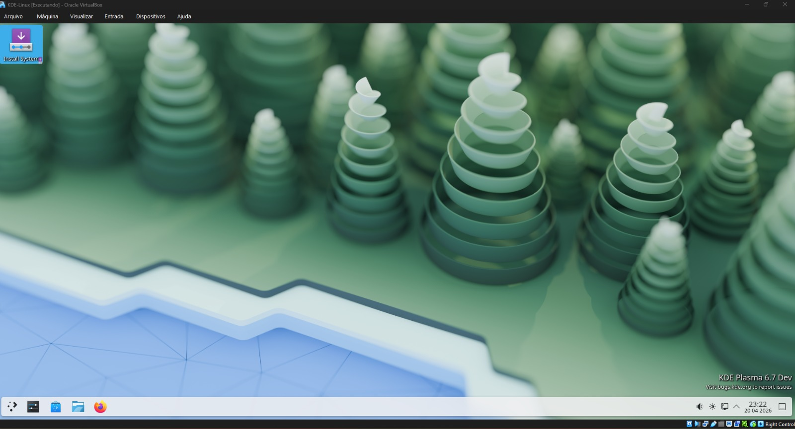

# Diário de Bordo – João Pedro

## Sprint 0 - 13/04/2026 - 19/04/2026

---

## Resumo da Sprint

Nesta sprint, o foco principal foi preparar o ambiente para rodar o **KDE Linux** em uma máquina virtual no Windows.

Durante o processo, enfrentei dificuldades relacionadas à configuração do ambiente, especialmente na conversão do arquivo `.raw` para um formato compatível com o VirtualBox e na inicialização da máquina virtual.

Apesar dos erros de boot enfrentados, consegui avançar significativamente na compreensão do processo de virtualização e na configuração de ambientes Linux experimentais.

---

| Data  | Atividade | Tipo (Código/Doc/Discussão/Outro) | Link/Referência | Status |
|------|----------|----------------------------------|----------------|--------|
| 17/04 | Instalação do VirtualBox | Setup | https://www.virtualbox.org/wiki/Downloads | Concluído |
| 18/04 | Download da imagem `.raw` do KDE Linux | Setup | https://kde.org/linux/docs/install-vm/ | Concluído |
| 18/04 | Conversão de `.raw` para `.vmdk` com VBoxManage | Código | - | Concluído |
| 19/04 | Criação da máquina virtual no VirtualBox | Setup | - | Concluído |
| 19/04 | Configuração de EFI, disco e tentativa de boot | Setup | - | Concluído |

---

## Maiores Avanços

- Consegui preparar meu ambiente local para desenvolver o projeto

---

## Maiores Dificuldades

- Falha de inicialização da imagem do KDE Linux

---

## Aprendizados

- Diferença entre formatos de disco (`.raw`, `.vmdk`, `.vdi`)  
- Importância do EFI/UEFI no boot de sistemas modernos  
- Uso de ferramentas de linha de comando do VirtualBox  
- Crição de máquinas virtuais funcionais

---

## Passo a Passo feito para Subir o KDE Linux no VirtualBox (Windows)

### 1. Download da imagem

Baixar o arquivo `.raw` do KDE Linux:

https://kde.org/linux/docs/install-vm/


---

### 2. Instalação do VirtualBox

Instalar o VirtualBox no Windows.

---

### 3. Conversão da imagem `.raw`

```powershell
cd "C:\Program Files\Oracle\VirtualBox"

& 'C:\Program Files\Oracle\VirtualBox\VBoxManage.exe' convertfromraw (Get-ChildItem kde-linux_*.raw).FullName kdelinux2.vmdk --format VMDK

```
## 4. Criação da Máquina Virtual

- Nome: KDE Linux  
- Tipo: Arch Linux 
- Versão: Arch Linux (64-bit)  

---

## 5. Configuração de Hardware

- Memoria Principal: 8192 MB  
- Processadores: 2

---

## 6. Configuração de Firmware

Ativar EFI:

Configurações → Sistema → Placa-mãe → Enable EFI  

---

## 7. Configuração do Disco

- Ir em Armazenamento  
- Adicionar o arquivo `.vmdk`  
- Conectar à controladora SATA ou IDE  

---

## 8. VM em execução



---

## Plano Pessoal para a Próxima Sprint

- [ ] Encontrar issue para contribuir no projeto  