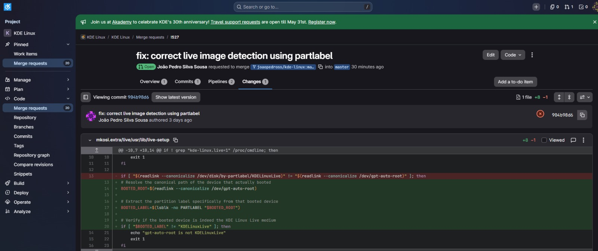
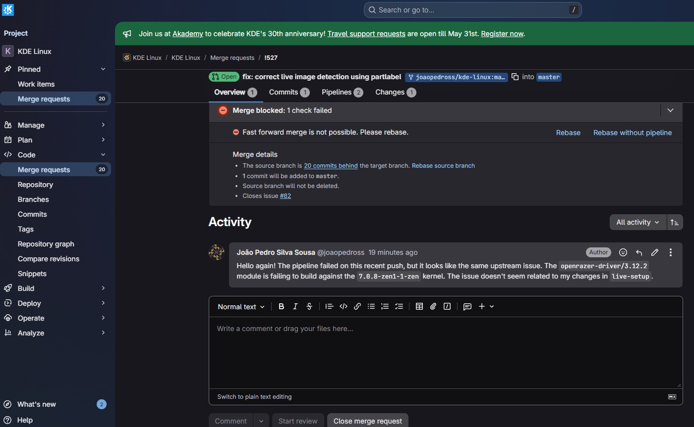
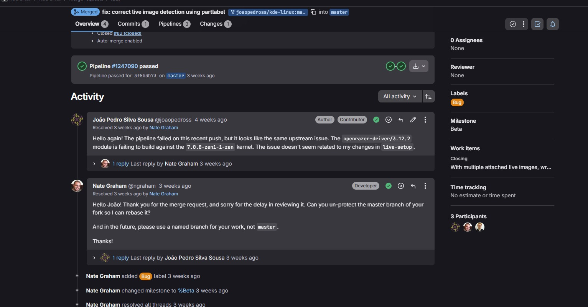
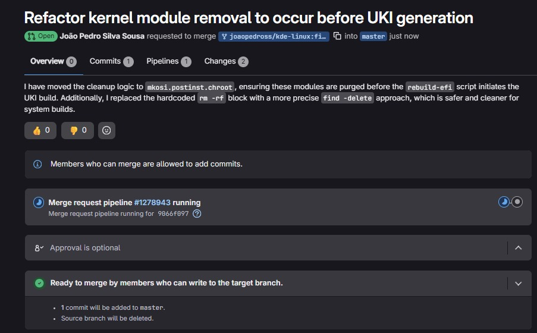
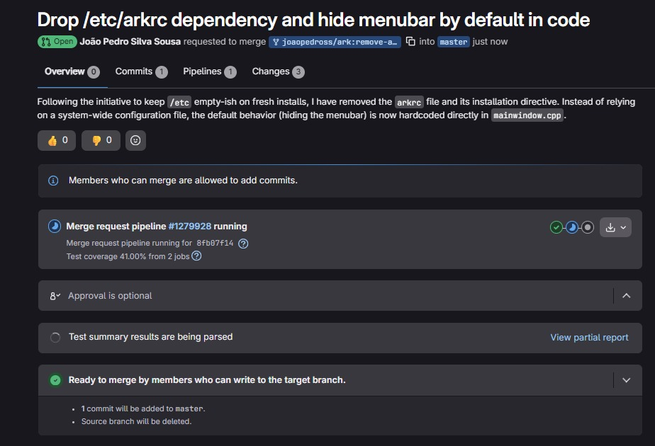

# Diário de Bordo – João Pedro

## Sprint 0 - 13/04/2026 - 19/04/2026

## Resumo da Sprint

Nesta sprint, o foco principal foi preparar o ambiente para rodar o **KDE Linux** em uma máquina virtual no Windows.

Durante o processo, enfrentei dificuldades relacionadas à configuração do ambiente, especialmente na conversão do arquivo `.raw` para um formato compatível com o VirtualBox e na inicialização da máquina virtual.

Apesar dos erros de boot enfrentados, consegui avançar significativamente na compreensão do processo de virtualização e na configuração de ambientes Linux experimentais.

---

| Data  | Atividade | Tipo (Código/Doc/Discussão/Outro) | Link/Referência | Status |
|------|----------|----------------------------------|----------------|--------|
| 17/04 | Instalação do VirtualBox | Setup | [Link](https://www.virtualbox.org/wiki/Downloads) | Concluído |
| 18/04 | Download da imagem `.raw` do KDE Linux | Setup |  [Link](https://kde.org/linux/docs/install-vm/) | Concluído |
| 18/04 | Conversão de `.raw` para `.vmdk` com VBoxManage | Código | - | Concluído |
| 19/04 | Criação da máquina virtual no VirtualBox | Setup | - | Concluído |
| 19/04 | Configuração de EFI, disco e tentativa de boot | Setup | - | Concluído |

---

## Maiores Avanços

- Consegui preparar meu ambiente local para desenvolver o projeto

---

## Maiores Dificuldades

- Falha de inicialização da imagem do KDE Linux

---

## Aprendizados

- Diferença entre formatos de disco (`.raw`, `.vmdk`, `.vdi`)  
- Importância do EFI/UEFI no boot de sistemas modernos  
- Uso de ferramentas de linha de comando do VirtualBox  
- Crição de máquinas virtuais funcionais

---

## Passo a Passo feito para Subir o KDE Linux no VirtualBox (Windows)

---

### 1. Download da imagem

Baixar o arquivo `.raw` do KDE Linux:

https://kde.org/linux/docs/install-vm/


---

### 2. Instalação do VirtualBox

https://www.virtualbox.org/wiki/Downloads

---

### 3. Conversão da imagem `.raw` para VMDK

```powershell
cd "C:\Program Files\Oracle\VirtualBox"

& 'C:\Program Files\Oracle\VirtualBox\VBoxManage.exe' convertfromraw (Get-ChildItem kde-linux_*.raw).FullName kdelinux2.vmdk --format VMDK

```
## 4. Criação da Máquina Virtual

- Nome: KDE Linux  
- Tipo: Arch Linux 
- Versão: Arch Linux (64-bit)  

---

## 5. Configuração de Hardware

- Memoria Principal: 8192 MB  
- Processadores: 2

---

## 6. Configuração de Firmware

Ativar EFI:

Configurações → Sistema → Placa-mãe → Enable EFI  

---

## 7. Configuração do Disco

- Ir em Armazenamento  
- Adicionar o arquivo `.vmdk`  
- Conectar à controladora SATA ou IDE  

---

## 8. VM em execução


---

## Plano Pessoal para a Próxima Sprint

- [ ] Encontrar issue para contribuir no projeto  

## Sprint 1 - 20/04/2026 - 04/05/2026

## Resumo da Sprint

Neste sprint, meu foco foi entender o projeto KDE Linux e conseguir iniciar minha primeira contribuição. No início, tive dificuldade em encontrar uma issue adequada para iniciantes, especialmente com a tag *Newcomer*. Após explorar o repositório e analisar diferentes tarefas disponíveis, consegui identificar uma issue compatível com meu nível.

Após encontrar a issue, entrei em contato com a comunidade do projeto solicitando autorização para trabalhar nela como parte de uma atividade acadêmica.

---

## Atividades

| Data  | Atividade | Tipo (Código/Doc/Discussão/Outro) | Link/Referência | Status |
| ----- | --------- | --------------------------------- | --------------- | ------ |
| 20/04 | Busca por issues com a tag Newcomer | Outro | - | Concluído |
| 22/04 | Análise de issues disponíveis no repositório | Outro | - | Concluído |
| 30/04 | Identificação de uma issue compatível | Outro | - | Concluído |
| 04/05 | Envio de mensagem solicitando contribuição na issue | Discussão | - | Concluído |

---

## Maiores Avanços

- Consegui encontrar uma issue adequada para iniciantes no projeto KDE Linux  
- Realizei o primeiro contato com a comunidade solicitando participação  
- Entendi melhor o funcionamento do fluxo de contribuição em projetos open source  

---

## Maiores Dificuldades

- Dificuldade em encontrar issues com a tag *Newcomer*  
- Necessidade de entender o contexto técnico das issues antes de escolher uma  
- Insegurança inicial sobre como abordar a comunidade do projeto  

---

## Aprendizados

- Aprendi a importância de analisar bem uma issue antes de escolher trabalhar nela  
- Entendi como funciona o primeiro contato com mantenedores em projetos open source  
- Percebi que a comunicação clara e educada é essencial ao contribuir com projetos reais  

---

## Mensagem enviada à comunidade


---

## Plano Pessoal para a Próxima Sprint

- [ ] Aguardar retorno da comunidade sobre a issue  
- [ ] Iniciar a contribuição no projeto

## Sprint 2 - 05/05/2026 a 18/05/2026

## Resumo da Sprint

Nesta sprint, o foco foi colocar a mão na massa após receber a autorização dos mantenedores do KDE. O objetivo era corrigir o bug no script `live-setup`, que se perdia e montava a partição errada quando havia mais de um pendrive conectado.

Tive que resolver vários problemas de ambiente na minha máquina virtual (falta de espaço no disco, configuração do Docker em BTRFS e erros de internet) até conseguir rodar a compilação (*build*) completa do sistema. No fim, abri o *Merge Request* oficial com sucesso.


---

# Atividades Realizadas

| Data | Atividade | Tipo | Referência | Status |
|------|------------|------|-------------|---------|
| 05/05 | Atribuição oficial e orientação na Issue #82 | Discussão | KDE GitLab #82 | ✅ Concluído |
| 08/05 | Configuração do Fork e ajuste de nome de autor no Git | Código | Terminal Git | ✅ Concluído |
| 11/05 | Configuração do Docker para usar o driver BTRFS | Setup | `daemon.json` | ✅ Concluído |
| 13/05 | Aumento do disco da máquina virtual de 30GB para 80GB | Setup | VirtualBox / KDE Partition | ✅ Concluído |
| 16/05 | Limpeza de cache para resolver erro de pacote corrompido | Setup | Terminal | ✅ Concluído |
| 17/05 | Compilação do sistema com sucesso (`build_docker.sh`) | Código | Terminal | ✅ Concluído |
| 18/05 | Abertura do Merge Request com documentação em inglês | Doc / Código | KDE Invent MR | ✅ Concluído |
| 18/05 | Investigação e relato da falha na Pipeline de testes | Análise | Logs do GitLab | ✅ Concluído |

---

# Maiores Avanços

## 1. Correção Definitiva do Bug

Mudei a forma como o script `live-setup` reconhece o pendrive. Em vez de procurar pelo nome (`by-label`), o que fazia ele pegar o primeiro que encontrasse, fiz o script olhar diretamente para o dispositivo que o sistema usou para dar boot (`/dev/gpt-auto-root`) e extrair a etiqueta dele usando o comando:

```bash
lsblk -no PARTLABEL
```

## 2. Configuração do Docker e Build

Consegui configurar o Docker para rodar nativamente com o sistema de arquivos BTRFS (uma exigência do projeto) e finalmente gerei a imagem `.raw` do sistema operacional.

---

## 3. Submissão do Merge Request

Abri o MR no repositório oficial do KDE com uma descrição clara em inglês, vinculando a correção à *issue* original para que ela seja fechada automaticamente após a aprovação.




# Maiores Dificuldades

- Falta de Espaço na Máquina Virtual (Disco Cheio): Meu disco virtual de 30GB lotou no meio do caminho. Tive que ir no VirtualBox, aumentar o disco para 80GB e usar o KDE Partition Manager para esticar a partição do Linux sem perder os dados.

- Erro na Pipeline do GitLab (Falso Positivo): Assim que abri o *Merge Request*, a *pipeline* de testes do servidor falhou (ficou com status vermelho). Deu um frio na barriga, mas ao ler os logs detalhadamente, vi que o erro não era no meu código.

Deixei um comentário no MR avisando os mantenedores sobre esse problema externo (*upstream*).




# Aprendizados

- Como usar a ferramenta `mkosi` para compilar e criar imagens de sistemas operacionais;
- Como redimensionar partições ativas de Linux (BTRFS) de forma segura;
- Como corrigir erros no histórico de commits do Git usando o comando `git commit --amend`;
- Como ler e interpretar logs de pipelines de CI/CD no GitLab para descobrir a verdadeira causa de um erro.

# Plano Pessoal para a Próxima Sprint

- [ ] Acompanhar o processo de *Code Review* e homologação efetuado pelo mantenedor Harald Sitter;

- [ ] Aplicar eventuais refatorações ou revisões de código sugeridas pela comunidade do KDE;

- [ ] Buscar nova issue.

---

## Sprint 3 - 25/05/2026 a 08/06/2026

## Resumo da Sprint

O grande destaque desta Sprint foi a **vitória final: o meu *Merge Request* foi oficialmente aceito e integrado (*merged*) ao projeto!** 🚀

O foco inicial foi o processo de *Code Review*. Recebi o feedback oficial do mantenedor (Harald Sitter), que indicou que a solução técnica estava validada, mas solicitou ajustes na infraestrutura do meu repositório e deixou uma orientação importante sobre boas práticas de Git.

A etapa consistiu em alterar as proteções da *branch* do meu *fork* no GitLab para permitir que o mantenedor fizesse um *rebase* do meu código com a versão mais recente do sistema. Após esse ajuste, o mantenedor pôde concluir o processo e **o meu código foi definitivamente mesclado com a versão oficial do KDE Linux**. Na reta final da sprint, iniciei a confecção do trabalho individual da disciplina, já que não encontrei novas issues abertas que estivessem adequadas para novas contribuições no momento.

---

## Atividades Realizadas

| Data | Atividade | Tipo | Referência | Status |
| :--- | :--- | :--- | :--- | :--- |
| 25/05 | Recebimento e análise do *Code Review* | Discussão | KDE GitLab MR | ✅ Concluído |
| 25/05 | Desbloqueio da *branch* `master` (*Unprotect*) no GitLab | Setup | Configurações do Repo | ✅ Concluído |
| 25/05 | Resposta formal ao mantenedor concordando com o *rebase* | Discussão | KDE GitLab MR | ✅ Concluído |
| 26/05 | **Aprovação e *Merge* definitivo no repositório oficial** | Código | KDE Invent | ✅ Concluído |
| 07/06 | Início do trabalho individual e busca sem sucesso por novas issues | Doc / Análise | Repositório KDE | ✅ Concluído |

---

## Maiores Avanços

### 1. MR aceito
O maior marco de todo o projeto: meu código foi validado, aceito e integrado à *branch* principal do KDE Linux. A funcionalidade e a correção do bug que desenvolvi agora fazem parte de um sistema operacional utilizado globalmente.

### 2. Ajuste de Infraestrutura no GitLab
Foi necessário navegar nas configurações do GitLab (`Settings > Repository > Protected branches`) e remover a proteção padrão da *branch* `master` para dar permissão de escrita aos *maintainers* do repositório *upstream*, permitindo a eles finalizar a integração de forma limpa.

---

## Interação de Code Review e Aprovação

Aqui está o registro do feedback do mantenedor, a minha resposta realizando o ajuste solicitado e a confirmação de que o código foi integrado (*Merged*):



> **Link do MR:** https://invent.kde.org/kde-linux/kde-linux/-/merge_requests/527

---

## Maiores Dificuldades

* Compreender as permissões e proteções automáticas de *branches* no GitLab, que inicialmente impediram o mantenedor de atualizar e mesclar o código diretamente.
* Encontrar novas *issues* com escopo acessível/adequado para dar continuidade imediata às contribuições no repositório.

---

## Aprendizados

* **Boas Práticas de Versionamento (Named Branches):** O mantenedor pontuou o erro mais clássico em *open source*: trabalhar e submeter código diretamente na *branch* `master`. Aprendi que o padrão da indústria é sempre criar uma *branch* com um nome descritivo (ex: `git checkout -b fix-live-setup`) para isolar as alterações e facilitar o *rebase* no futuro.
* O funcionamento prático do processo de *Rebase* e *Merge* para manter o histórico de *commits* limpo e linear em projetos de grande escala.

---

## Plano Pessoal para a Próxima Sprint

- [ ] Procurar ativamente por novas *issues* abertas para continuar contribuindo no ecossistema KDE;

---

# Sprint 4 - 09/06/2026 a 22/06/2026

## Resumo da Sprint
Nesta sprint, o foco foi aplicar um nível maior de senioridade técnica, expandindo o escopo de contribuições no ecossistema KDE. As atividades saíram de *scripts* de conveniência para intervenções diretas na arquitetura. A primeira frente resolveu a instabilidade na geração da imagem **UKI** (*Unified Kernel Image*) do KDE Linux, mitigando conflitos de dependências de módulos do kernel. A segunda frente focou na refatoração de código **C++** e limpeza do sistema de *build* (**CMake**) da aplicação KDE Ark, eliminando dívidas técnicas e poluição de arquivos de configuração do sistema.

---

## Atividades Realizadas

| Data | Atividade | Referência |
| :--- | :--- | :--- |
| 09/06 | Pesquisa e seleção da Issue #636 (Build UKI/Kernel) | GitLab #636 |
| 10/06 | Análise da lógica de build do *mkosi* e ordens de execução | Repositório KDE |
| 12/06 | Implementação da limpeza de módulos via `find -delete` | `mkosi.postinst.chroot` |
| 14/06 | Refatoração: remoção da abordagem `rm -rf` obsoleta | `40-core.sh.chroot` |
| 16/06 | Testes de build local e validação de dependências | Máquina Virtual |
| 29/06 | Submissão do Merge Request com descrição técnica | KDE Invent |
| 18/06 | Pesquisa e seleção da Issue de arquitetura (Poluição em `/etc`) | Repositório KDE |
| 19/06 | Clonagem e análise do código-fonte C++ e framework Qt | Repositório Ark |
| 20/06 | Refatoração da interface e testes de compilação | `mainwindow.cpp` |
| 21/06 | Limpeza do Build System e exclusão do artefato obsoleto (`arkrc`) | `CMakeLists.txt` |
| 30/06 | Submissão do Merge Request de refatoração do KDE Ark | KDE Invent |
---

## Detalhamento Técnico: KDE Linux (Geração de UKI)

### 1. O Problema: Conflitos no UKI
O sistema tentava gerar uma imagem de boot (UKI) que incluía o módulo `kafs`. Ocorre que o `kafs` possui uma dependência obrigatória no `rxrpc`. Como o projeto KDE Linux bloqueia o `rxrpc` por segurança (vulnerabilidade *dirtyfrag*), o *build* quebrava ao tentar montar a imagem.

### 2. A Solução Implementada
Reestruturei o *pipeline* para garantir que a remoção fosse feita antes da geração do bootloader:
* **Remoção Preditiva:** Utilizei o comando `find` com a flag `-delete` dentro do `mkosi.postinst.chroot`. 
* **Sincronia:** Posicionei essa limpeza **antes** da execução do script `rebuild-efi`. Isso garante que o gerador de boot (UKIFY) trabalhe sobre um diretório de módulos já "higienizado".

```bash
# Limpeza de módulos vulneráveis/não utilizados
find /usr/lib/modules/"$kernel_version" -type f \( \
    -name "af_alg.ko.zst" -o \
    -name "algif_*.ko.zst" -o \
    -name "esp4.ko.zst" -o \
    -name "esp6.ko.zst" -o \
    -name "rxrpc.ko.zst" -o \
    -path "*/net/rxrpc/*" -o \
    -path "*/fs/afs/*" \
    \) -delete
```

## Submissão e Merge Request (KDE Linux)

A solução foi submetida via *Merge Request* após a refatoração do script de pós-instalação. O objetivo foi mover a lógica de segurança para antes da fase de geração do *bootloader*, garantindo a integridade do UKI.

> **Status do MR:** https://invent.kde.org/kde-linux/kde-linux/-/merge_requests/565



---

## Detalhamento Técnico: KDE Ark (Refatoração C++ e CMake)

### 1. O Problema: Poluição do diretório `/etc`
A equipe core do KDE levantou uma *issue* arquitetural: distribuições Linux modernas (especialmente as imutáveis) devem manter o diretório `/etc` o mais limpo possível, reservando-o estritamente para configurações manuais de administradores. No entanto, o descompactador oficial do sistema (Ark) instalava um arquivo de configuração (`arkrc`) no `/etc` com o único propósito de forçar a barra de menus a iniciar oculta no primeiro acesso do usuário.

### 2. A Solução Implementada
A dívida técnica foi eliminada transferindo a responsabilidade da configuração do sistema de arquivos para a lógica interna da própria aplicação. O fluxo de refatoração consistiu em três frentes:

* **Lógica de Interface C++ (`mainwindow.cpp`):**
  Foi injetada a chamada para ocultar a barra de menus imediatamente antes da inicialização da GUI (`setupGUI(...)`). Isso define o estado de fábrica como "oculto". Como a alteração ocorre antes da leitura das configurações locais, se o usuário já possuir uma preferência salva em seu ambiente (ex: menu visível em `~/.config/arkrc`), a função `setupGUI` a respeita e sobrescreve o comando inicial de forma transparente.

```cpp
    setXMLFile(QStringLiteral("arkui.rc"));
    
    // Esconde a barra de menus por padrão no primeiro acesso (remove a necessidade do /etc/arkrc)
    menuBar()->hide();
    
    setupGUI(ToolBar | Keys | Save);
```

* **Remoção de Artefato Obsoleto:**
  O arquivo físico `app/arkrc`, que se tornou inútil após a refatoração do código, foi excluído do repositório.
* **Limpeza do Build System (`CMakeLists.txt`):**
  A diretiva de empacotamento `install(FILES arkrc DESTINATION ${KDE_INSTALL_CONFDIR})` foi removida do arquivo de configuração do CMake. Isso otimiza o *build*, garantindo que o arquivo não seja mais compilado e distribuído nas futuras instalações.

## Submissão e Merge Request (KDE Ark)

A solução foi validada localmente, recompilando o projeto através do `cmake` e garantindo o comportamento esperado da interface sem depender de configurações globais de sistema, sendo posteriormente submetida ao repositório oficial.

> **Status do MR:** https://invent.kde.org/utilities/ark/-/merge_requests/335



---

## Principais Aprendizados da Sprint

* **Arquitetura e Integração:** Compreensão do ciclo de vida de uma imagem imutável (`mkosi`) e resolução preditiva de conflitos de dependências do Kernel.
* **C++ & Qt:** Compreensão prática do ciclo de inicialização de janelas `KXmlGuiWindow` e manipulação de componentes visuais (`QMenuBar`).
* **Sistemas de Build (CMake):** Entendimento de como o *build* orquestra o empacotamento e a alocação de arquivos no sistema operacional do usuário final.
* **Engenharia de Software:** Aplicação do conceito de tratar a causa raiz (comportamento padrão via código) em vez de manter soluções paliativas (arquivos de configuração forçados no sistema).
