# Diário de Bordo – Victório Lázaro

## Sprint 0 - 13/04/2026 - 19/04/2026

### Resumo da Sprint

Neste sprint fiquei focado em conseguir rodar o projeto e conseguir fazer minha primeira contribuição. Consegui rodar o projeto e encontrei uma issue com a tag Newcomer e pedi para fazer ela para a comunidade do KDE Linux, só que não consegui abrir um PR para ela na Sprint 0.

| Data  | Atividade | Tipo (Código/Doc/Discussão/Outro) | Link/Referência | Status |
| ----- | --------- | --------------------------------- | --------------- | ------ |
| 15/04 | Pedido para fazer uma issue com a tag Newcomer | Comentário |  [Link](https://invent.kde.org/kde-linux/kde-linux/-/work_items/164#note_1470816) | Concluído |
| 16/04 | Criação do fork | Código | [Link](https://invent.kde.org/victoriolazaro/kde-linux) | Concluído |
| 18/04 | Configuração do ambiente para desenvolvimento do KDE-Linux | Código | [Link](https://kde.org/linux/docs/install-vm/)   | Concluído |
| 18/04 | Criação do relatório de contribuição individual | Doc | - | Concluído |

### Maiores Avanços

* Consegui uma issue com a tag Newcomer para fazer na próxima sprint
* Consegui preparar meu ambiente local para desenvolver o projeto

### Maiores Dificuldades

* Poucas issues com a tag Newcomer
* Para buildar a imagem do KDE-Linux precisa de uma rede de internet boa

### Aprendizados

* Aprendi a como desenvolver um projeto de um sistema operacional, é bem diferente do comum além de ter que usar máquina virtual
* Fiz um tutorial sobre como rodar o projeto e vou disponibilizar a seguir para que os outros integrantes do meu grupo consigam usar

## Buildar imagem local do KDE-Linux com Virtual Machine Manager

Meu SO é um Ubuntu 22.04. Para buildar localmente a imagem do KDE-Linux com docker, existe um arquivo shell na raiz do projeto chamado build_docker.sh. Só que pra rodar esse script shell é necessário usar o driver de armazenamento BTRFS mas meu SO usa um driver diferente. Para mudar o driver, a documentação do KDE sugere rodar alguns comandos só como eu já tenho outros containers dockers na minha máquina, eu decidi não alterar globalmente o driver de armazenamento. Em vez disso, vou fazer uma VM dedicada para build. A VM vai possuir o SO KDE Linux (que já usa BTRFS direto). Isso evita o risco de quebrar meu Docker da host.

Para instalar o KDE Linux na VM para build usando Virtual Machine Manager existe [uma documentação no site do KDE](https://kde.org/linux/docs/install-vm/#virtual-machine-manager-virt-manager). Primeiro, eu baixei o arquivo .raw com a versão mais recente do KDE.

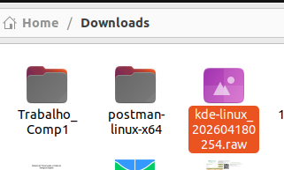

Em seguida fui no Virtual Machine Manager e selecionei para criar uma VM

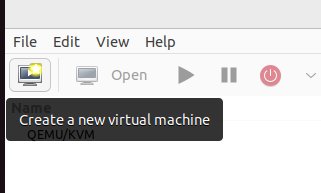

No primeiro passo que aparece na tela, selecionei "Import existing disk image" e cliquei no botão "Forward"

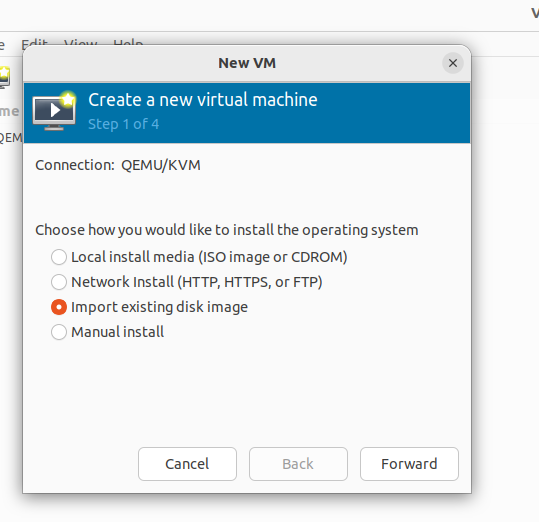

No segundo passo, eu cliquei em Browse, selecionei o arquivo .raw do KDE-Linux e cliquei no botão para escolher esse volume. No campo para escolher o SO, escrevi Arch Linux. Depois cliquei em "Forward". 

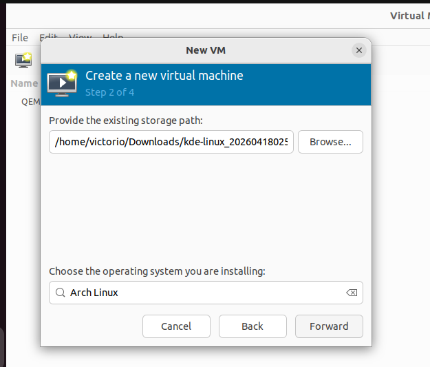

No terceiro passo, a documentação do KDE recomenda escolher CPU no mínimo 2 e idealmente 4+. Para memória, ela sugere no mínimo 2GB e idealmente 4+. Escolhi os valores mostrados na foto abaixo

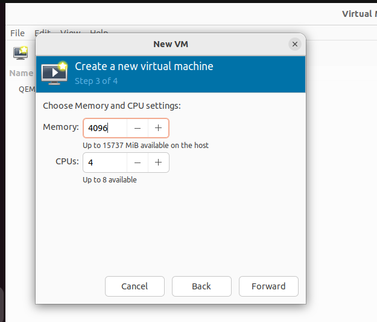


No quarto e último passo, eu habilitei o checkbox "Customize configuration before install" e depois cliquei em "Finish"

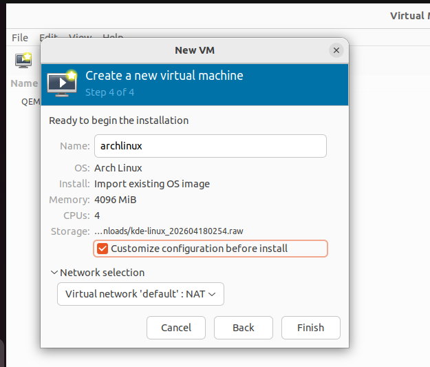

A janela de configuração da nova VM é aberta. Em Overview > Details > Firmware, selecionei UEFI e depois cliquei em "Add Hardware"


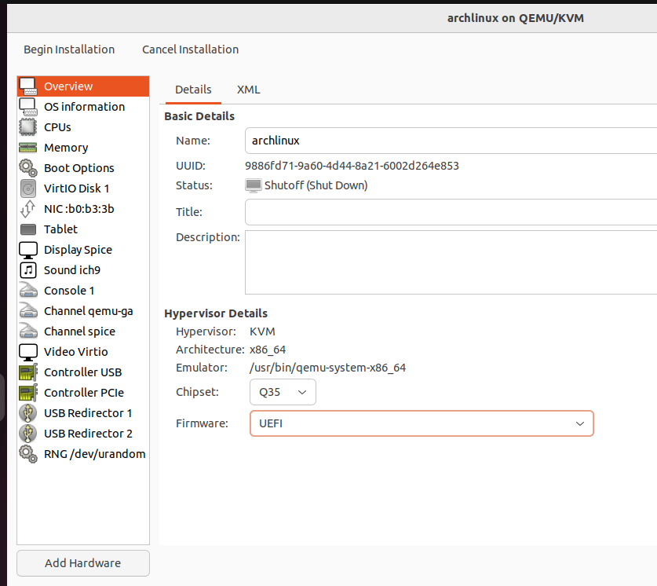


Depois de clicar em adicionar hardware, fui em Storage > Details tab e cliquei no botão "Create a disk image for the virtual machine" e defini o tamanho do disco para 20 GiB ( a documentação recomenda no mínimo  15 GB e idealmente mais de 20 GB). Depois cliquei em "Finish"

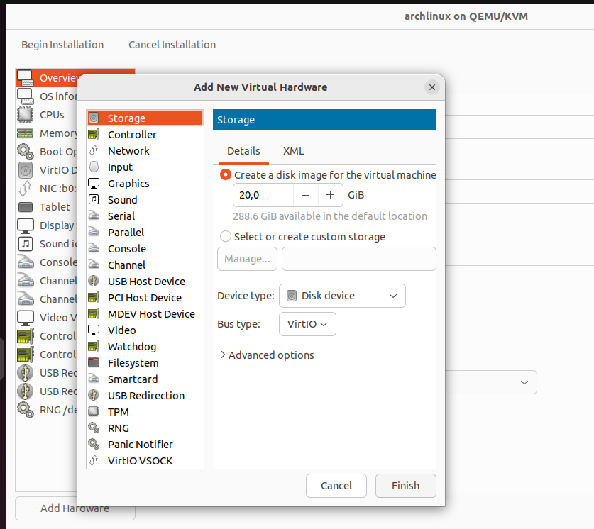

Depois que esse modal fechou, cliquei em "Begin Installation" no canto superior esquerdo para iniciar a VM.

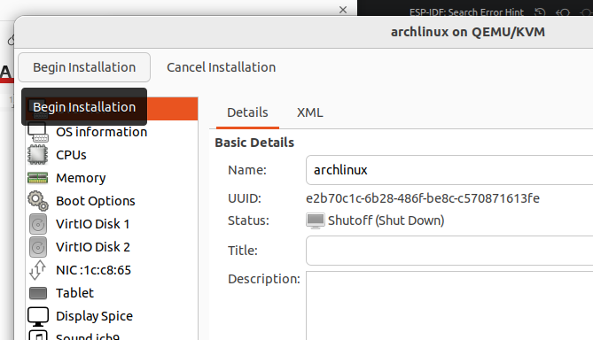

No boot, aparece uma tela para selecionar a partição do SO, escolhi a 2ª partição, vdb, 0 e deletei o conteúdo dela. Depois que a instalação acabou, desliguei a VM.

VirtIO Disk 1 contém o arquivo raw do KDE-Linux. Depois que a instalação acabou, fui em Details na VM e removi a partição de 6.50 GiB, deixando só a de 20 GiB

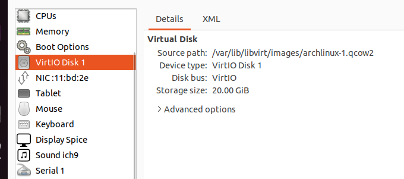

Depois disso, só segui o passo-a-passo fornecido pelo próprio SO para criar a conta

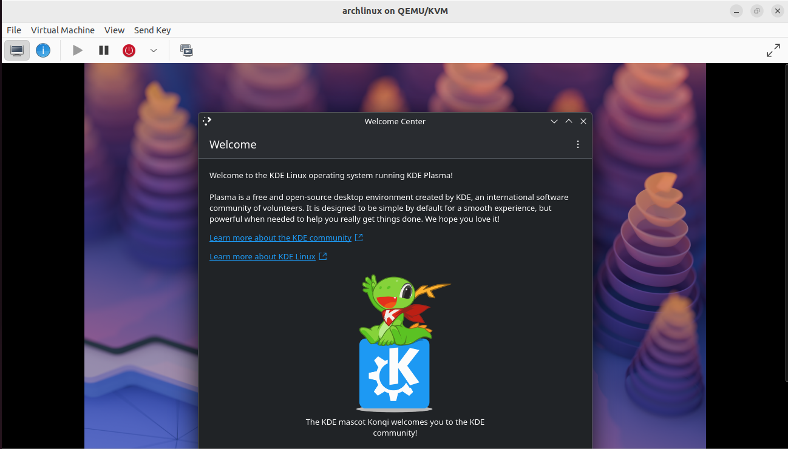

Para buildar as imagens do meu repositório fork do KDE-Linux eu clonei o repositório na VM. 

Para compartilhar arquivos entre a VM e meu host, uso o VirtioFS. Primeiro, desligue a máquina. Vá em Details e habilitei a opção "Enable shared memory"

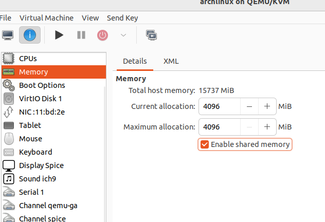

Em seguida, vá em Add Hardware e selecione um Filesystem.

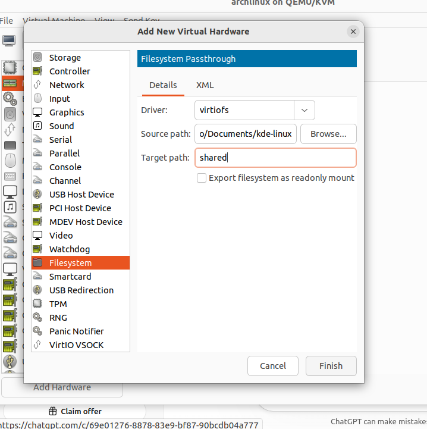

No terminal da pasta compartilhada na VM, é só dar os comandos abaixo para montar o repositório compartilhado

```
sudo mkdir -p /mnt/shared
sudo mount -t virtiofs shared /mnt/shared
```

O SO já vem com o Docker instalado. Eu só precisei dar comando “sudo systemctl start docker” para iniciar o serviço

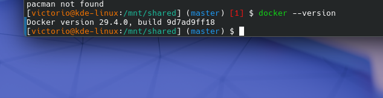

Eu quero buildar a imagem do KDE Linux alterada por mim para conseguir criar uma VM com ela e visualizar as alterações feitas por mim. Na documentação do KDE, é sugerido para acelerar os builds locais criar e personalizar o arquivo mkosi.local.conf na raiz do projeto com o seguinte conteúdo:

```
[Content] 
Environment=LOCALE_GEN="en_US.UTF-8 UTF-8" # replace with your locale Environment=MIRRORS_COUNTRY=us # replace with your country code Environment=PARALLEL_DOWNLOADS=50 # if your internet connection is fast 
```

Tendo feito esse arquivo e personalizado, eu adicionei ao /etc/docker/daemon.json o texto abaixo

```
{
  ...
  "storage-driver": "btrfs"
}
```

Em seguida, eu rodei “systemctl restart docker.socket docker.service” para atualizar o docker e “./build_docker.sh” na raiz do repositório do meu fork que está dentro da VM para buildar a imagem.

### Plano Pessoal para a Próxima Sprint

* [x] Resolver issue que pedi para a comunidade do KDE-Linux

## Sprint 1 - 20/04/2026 - 04/05/2026

### Resumo da Sprint

Nesta sprint fiquei focado em contribuir para o projeto e submeti meu primeiro Merge Request para o KDE Linux. A issue que fiz é a [164](https://invent.kde.org/kde-linux/kde-linux/-/work_items/164#note_1470816) 

| Data  | Atividade | Tipo (Código/Doc/Discussão/Outro) | Link/Referência | Status |
| ----- | --------- | --------------------------------- | --------------- | ------ |
| 30/04 | Primeiro MR para o KDE Linux | Código |  [Link](https://invent.kde.org/kde-linux/kde-linux/-/merge_requests/501) | Concluído |
| 30/04 | Avisei para a comunidade sobre minha contribuição | Comentário |  [Link](https://invent.kde.org/kde-linux/kde-linux/-/work_items/164#note_1484829) | Concluído |

### Maiores Avanços

* Consegui fazer uma issue com a tag Newcomer
* Consegui não só buildar a imagem mas alterar o código e ver minhas alterações funcionando
* Testei a imagem que gerei com minhas alterações em outra VM

### Maiores Dificuldades

* Para buildar a imagem do KDE-Linux precisa de uma rede de internet boa
* Mesmo com uma boa internet, processo de build é lento, tenho que esperar meia hora para completar o build e verificar se minhas alterações funcionaram


### Aprendizados

* Compreendi mais sobre como o build funciona
* Aprendi mais sobre o código do repositório

### Plano Pessoal para a Próxima Sprint

* [ ] Procurar nova issue NewComer para contribuir
